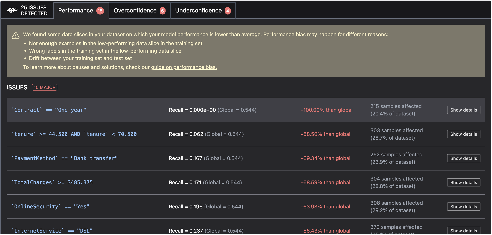
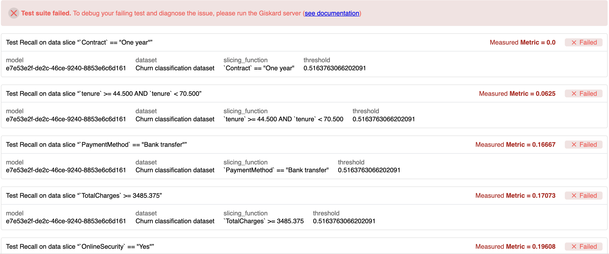
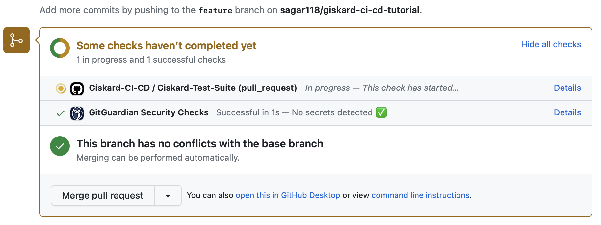
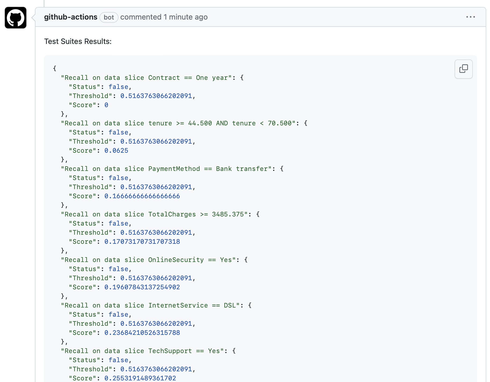

# Mastering Machine Learning Validation with Giskard: CI/CD Integration

Welcome to this tutorial repository, where we explore the use of Giskard in the context of CI/CD integration.

This tutorial is part of the [Mastering Machine Learning Validation with Giskard: From Detection to CI/CD Integration]() article.

To see how Giskard detects vulnerabilities in our model in action, you can demo the notebook in Google Colab: 

## Features

- **Model Validation**: Detect potential issues in your machine learning models using Giskard's comprehensive scanning capabilities.
- **Test Suites**: Create and customize test suites to systematically validate your models and ensure issues are addressed.
- **Custom Tests**: Tailor your validation with custom tests to meet specific requirements.
- **CI/CD Integration**: Integrate Giskard into your CI/CD pipeline to ensure your models are always validated before deployment.

Below, we'll explain the code structure and how to use it effectively.

## Usage

We have provided a simple Python script named run_test_suites.py that utilizes the giskard package to scan a model, run a test suite, and save the results in a JSON format, suitable for consumption by your CI/CD pipeline.

The script is designed to be triggered by your CI/CD pipeline when a pull request is created or updated. The pipeline will execute the script and display the results in the pull request comments.

In this tutorial, we use a simple logistic regression model trained on the [Customer Churn dataset](https://raw.githubusercontent.com/Giskard-AI/examples/main/datasets/WA_Fn-UseC_-Telco-Customer-Churn.csv).

You can find the `trained model` in the `model` directory, and the `validation dataset` is provided in the data directory.

Snapshots of the Scan Results, Test Suite Results, and CI/CD Integration are provided below.

### Scan Results

### Test Suite Results

### CI/CD Workflow Initiated

### PR Comment

